## Workshop Sponsors

We would like to thank our sponsors.

ICTS for NIH CTSA Grant #UL1 TR000448

Alvin J. Siteman Cancer Center, Grant # P30CA091842

---

## Goals of the Workshop

After this workshop you will be able to:

* Discuss the main principles of efficient data visualization
* Explain the meaning and purpose of Grammar of Graphics 
* Identify and analyze Key Performance Indicators with the goal of providing actionable insights
* Build charts using rCharts package for R
* Develop Shiny apps and dashboards, and implement rCharts inside these apps


---

## Principles of Efficient Data Visualization 

Principle 1: For data visualization in general - build around a story (quote Dona Wong)
 - Graphs and charts are not meant for decoration, they must deliver a clear message

<div align="center">
  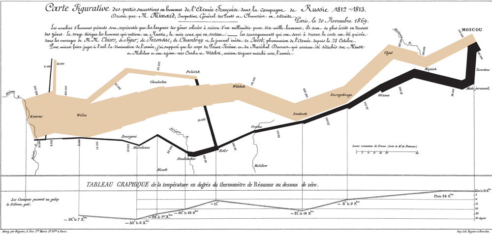
  </div>
  
by Charles Joseph Minard

---

## Principle 2

Limit visualization to a few highlights, don't overload with color, shapes, text
<div align="center">
  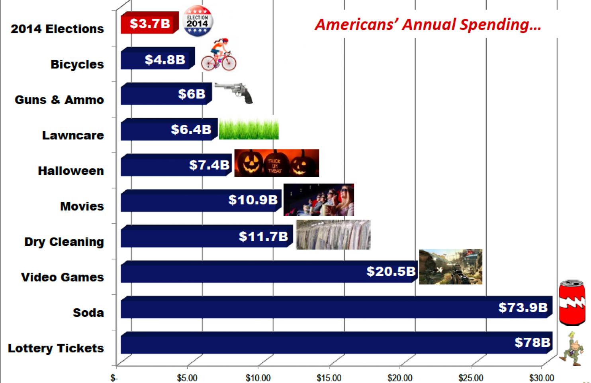
  </div>

---

## Principle 3

Choose appropriate display media

<div align="center">
  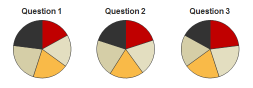
  </div>

---

## Principle 3

<div align="center">
  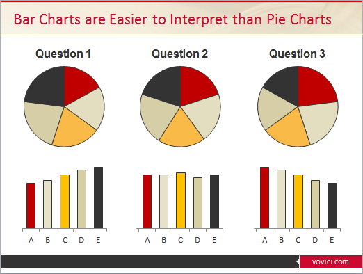
  </div>

---

## Choice of Charts 


<div align="center">
  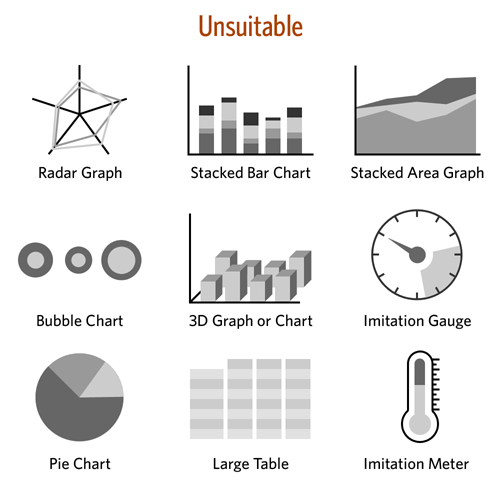
  </div>

Stephen Few's advice on choice of charts

---

<div align="center">
  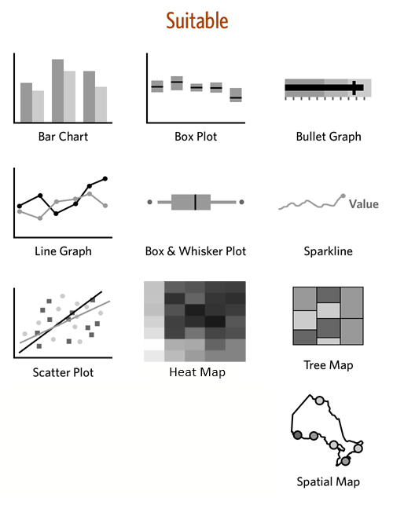
  </div>

---

## A note about Gauges and Bullet Graphs 


<div align="center">
  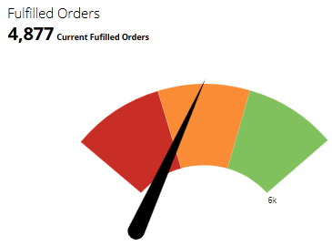
  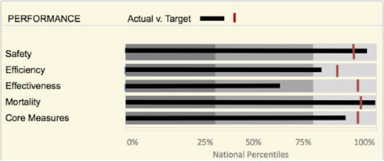
  </div>
<br><br><br><br><br>

Gauge example from Domo http://www.domo.com/roles/operations
vs. a bullet chart


---

## Charting Exercise

You have 30 seconds to draw this relationship in a chart with the goal to deliver a clear message
You need a piece of paper and a pen/pencil

<h3>Spending on Grants by US Government in 2014</h2>

| State         | Dollars (bln) |
| ------------- |:-------------:| 
| Missouri      | 7.9           | 
| California    | 55.0          | 
| Texas         | 33.4          | 


---

## Common Methods in KPI Development

* brainstorming
* adoption from other organizations or benchmarking
* using existing measures 
* measures enforced by stakeholders or executives


---

## Correct Method

Source: Stacey Barr (http://staceybarr.com/)

> * focus on desired results (derived from goals and objectives)
> * how these results are different from what is now
> * quantify and qualify the differences

---

## The Result

* few measures that are clear, actionable and have the team buy-in
* measures are used in decision making 
* measures are used to track progress over time towards the strategic result


---

## Common pitfalls of KPIs

* data inaccessible
* no consistency or clarity in measurement

---

## CBMI Example

<div align="center">
  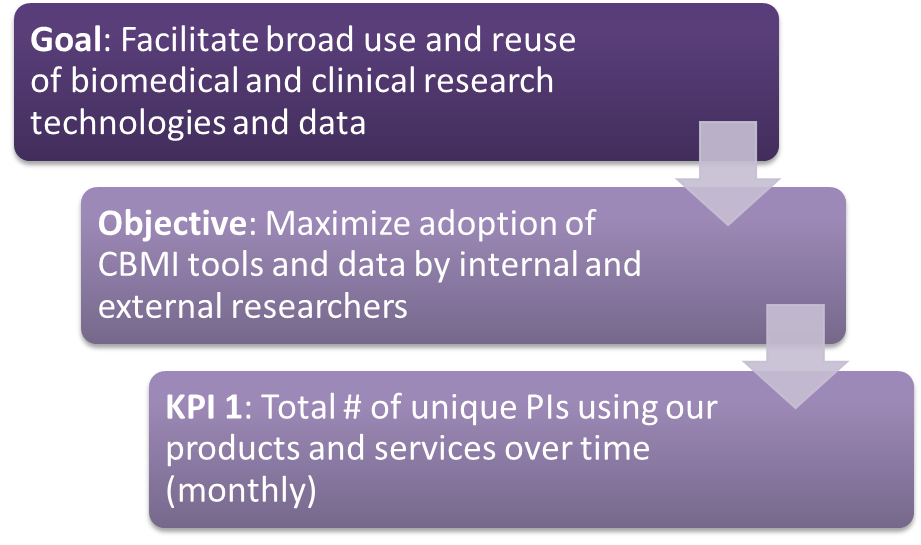
  </div>

---

## KPIs and Dashboard Design

Main principles of dashboard design by Stephen Few
- 7 +/- 2 elements
- one screen, no scrolling
- a dashboard is a utility not a piece of art -> little embellishments
- mild color-, pattern- encoding 


---

## Examples of poor dashboards 

1 and 2 are from iDashboards Pharmaceuticals demo

---

<div align="center">
  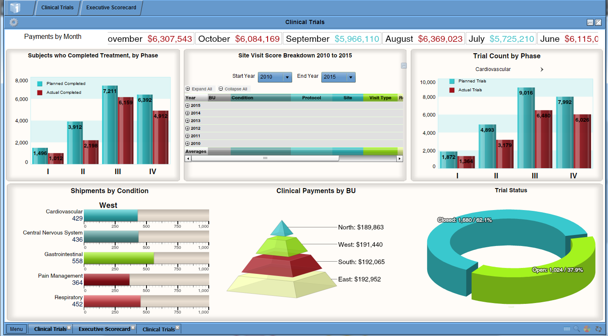
  </div>

---

<div align="center">
  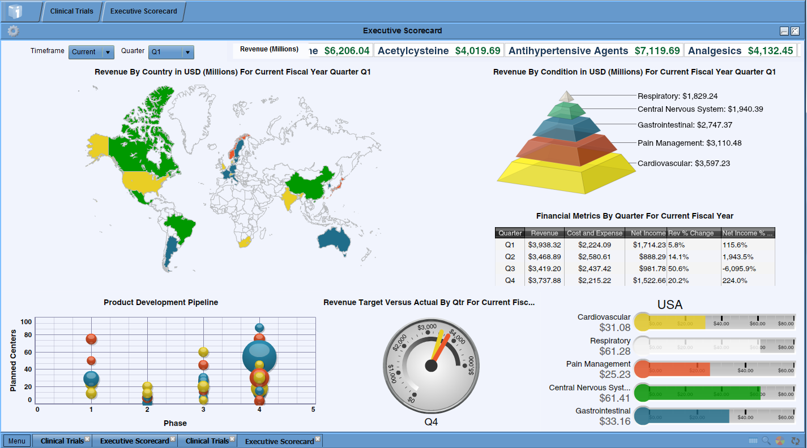
  </div>

---


<div align="center">
  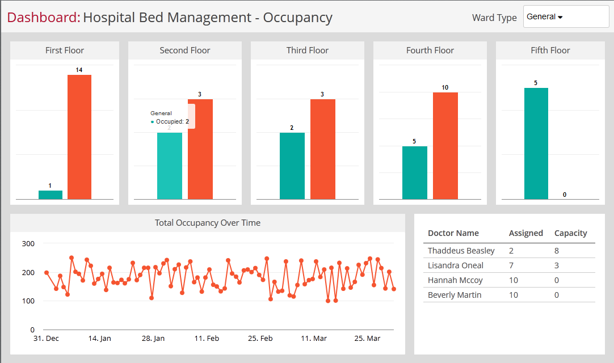
  </div>

Example from Clicdata demo

---

<div align="center">
  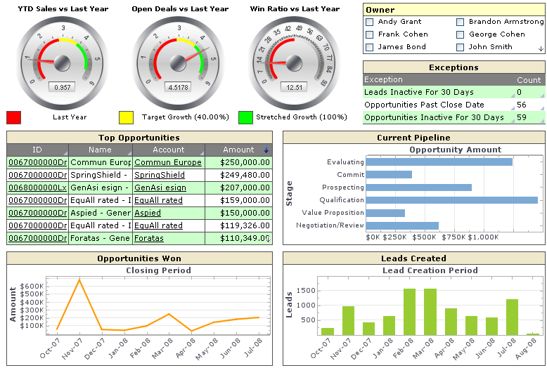
  </div>

Another example with gauges


---

### Example of a dashboard by Stephen Few

<div align="center">
  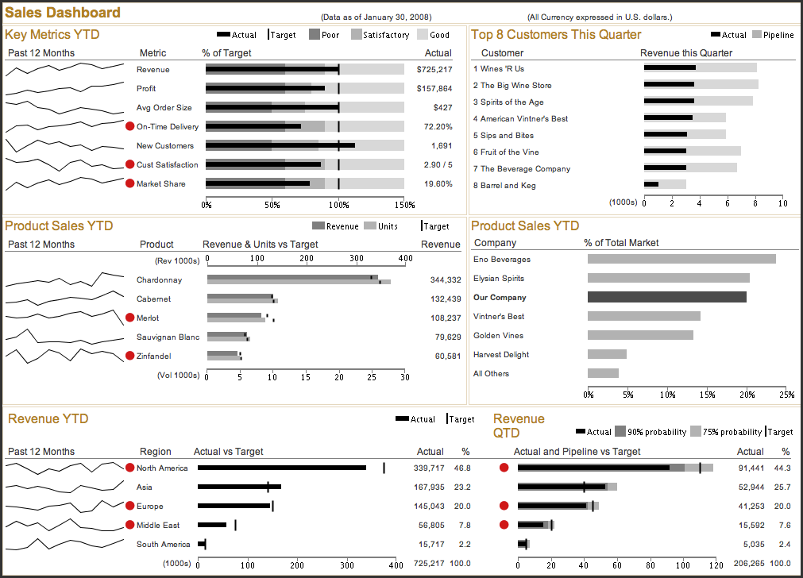
  </div>

---

## Brief Intro to Grammar of Graphics 

<div align="center">
  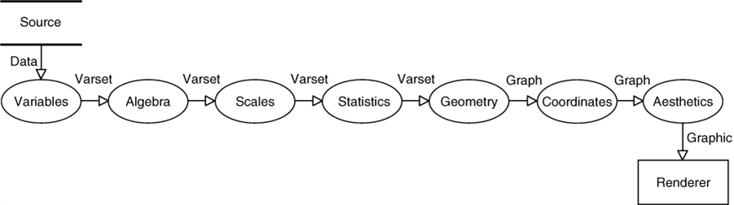
  </div>


---

## What is R?

* open-source programming language, first developed for statistical analyses on the foundation of S language
* massively contributed to for over 20 years (NOTE: 2 years older than Java or JavaScript) by 2 million users and thousands of developers worldwide
* over 5000 packages in statistics, data management and analysis, API with databases, websites and software tools, data visualization and more


---

## A little about rCharts

* rCharts is an R package to create, customize and publish interactive JavaScript visualizations 
* Developed by Ramnath Vaidyanathan, creator of Slidify
* uses a familiar lattice style plotting interface
* R code is converted to JavaScript on the back end, see it when you type 

```
mychart$print()
```

* rCharts by itself is interactive to a point, but within a Shiny app it allows input and modification of data in the chart
* Installation: 

```
require(devtools) 
install_github('rCharts', 'ramnathv') 
```


---

## Working with rCharts

* Load the package, using library()
* Prepare data
* Create plot as is or assign it to a variable (latter will allow reusing it as a self-contained object)

 

---

# Interactive Chart
```{r echo = F, results = 'asis', message=FALSE, warning=FALSE}
library(rCharts); library(plyr)
#read in JIRA data 
merged <- read.csv("data/merged.csv")
PI_by_product <- ddply(merged, c("Application"), summarise, uniquePIs = length(unique(PI_name)))
mostPopularProduct <- hPlot(uniquePIs ~ Application, type = 'column', data = PI_by_product, title = "Most Popular Product")
mostPopularProduct$chart(height = 350)
mostPopularProduct$print('chart1')
```
``` {r eval=FALSE}
library(rCharts); library(plyr)
merged <- read.csv("data/merged.csv")
PI_by_product <- ddply(merged, c("Application"), summarise, uniquePIs = length(unique(PI_name)))
mostPopularProduct <- hPlot(uniquePIs ~ Application, type = "column", data = PI_by_product, 
                            title = "Most Popular Product")
mostPopularProduct
```

---

## Data for the Interactive Chart above

```{r results='asis'}
knitr::kable(head(merged, 4))
knitr::kable(head(PI_by_product, 4))
```

---
## Popular rCharts libraries:

* Polychart (rPlot() function for basic, but powerful charts, inspired by ggplot2)
* Morris (mPlot() function for pretty time-series line graphs)
* NVD3 (nPlot() function based on d3js library for amazing interactive visualizations with little code and customization)
* xCharts (xPlot() function for slick looking charts using d3js, made by TenXer)
* HighCharts (hPlot() function interactive charts, time series graphs and map charts)
* Leaflet (Leaflet$new() function for mobile-friendly interactive maps)
* Rickshaw (Rickshaw$new() function for creating interactive time series graphs, developed at Shutterstock)

---

## Line Chart with Customization

```{r echo = F, results = 'asis'}
#function to convert to POSIXct date format, specifically for line chart
to_jsdate2 <- function(x){
  as.numeric(as.POSIXct(as.Date(x), origin="1970-01-01")) * 1000
}
#we use the same "merged" dataset from the previous example
#change the date columns format to Date
merged$created <- as.Date(merged$created, format = "%m/%d/%Y %H:%M")

#sort the data by date
merged <- merged[order(merged$created),]

#create a month variable for aggregation
merged$created_month <- as.Date(cut(merged$created, "month"))

#create a vector with cumulative sum of unique PIs
unique_PIs <- cummax(as.numeric(factor(merged$PI_name, levels = unique(merged$PI_name))))

#matching cumulative sum of unique PIs to unique months
PI_cumul_growth <- aggregate(unique_PIs, list(Month=merged$created_month), max)

#change the date format to suit rCharts
PI_cumul_growth$date <- to_jsdate2(as.Date(PI_cumul_growth$Month))
#plot a line chart
PI_growth_plot <- hPlot(x ~ date, type = "line", data = PI_cumul_growth)
PI_growth_plot$title(text = "Adoption of Products and Services")
PI_growth_plot$xAxis(type='datetime', title = list(text = "Time"))
PI_growth_plot$yAxis(title = list(text = "PIs"), 
                        labels = list(style=list(color= '#000066', fontWeight= 'bold')),
                        min = 0, gridLineColor = "#ffffff")
PI_growth_plot$plotOptions(line = list(color = "#6699FF", marker = list(enabled = F)))
PI_growth_plot$tooltip(dateTimeLabelFormats = list(month = "%B %Y"))
PI_growth_plot$chart(zoomType="x", height = 500)
PI_growth_plot$print('chart2')

```


---

# Code for Line Chart

```
#function to convert the date format into suitable for rCharts
to_jsdate2 <- function(x){
  as.numeric(as.POSIXct(as.Date(x), origin="1970-01-01")) * 1000
}
#we use the same "merged" dataset from the previous example
#change the date columns format to Date
merged$created <- as.Date(merged$created, format = "%m/%d/%Y %H:%M")

#sort the data by date
merged <- merged[order(merged$created),]

#create a month variable for aggregation
merged$created_month <- as.Date(cut(merged$created, "month"))

#create a vector with cumulative sum of unique PIs
unique_PIs <- cummax(as.numeric(factor(merged$PI_name, levels = unique(merged$PI_name))))

#matching cumulative sum of unique PIs to unique months
PI_cumul_growth <- aggregate(unique_PIs, list(Month=merged$created_month), max)

```

---

# Code for Line Chart (cont.)

How the PI_cumul_growth dataset looks like
```{r}
knitr::kable(head(merged[,c("created","PI_name", "created_month")], 4))
knitr::kable(head(PI_cumul_growth, 4))

```


---

# Code for Line Chart (cont.)
 

``` {r eval=FALSE}
#change the date format to suit rCharts
PI_cumul_growth$date <- to_jsdate2(as.Date(PI_cumul_growth$Month))
#plot a line chart
PI_growth_plot <- hPlot(x ~ date, type = "line", data = PI_cumul_growth)
PI_growth_plot$title(text = "Adoption of Products and Services")
PI_growth_plot$xAxis(type='datetime', title = list(text = "Time"))
PI_growth_plot$yAxis(title = list(text = "PIs"), 
                        labels = list(style=list(color= '#000066', fontWeight= 'bold')),
                        min = 0, gridLineColor = "#ffffff")
PI_growth_plot$plotOptions(line = list(color = "#6699FF", marker = list(enabled = F)))
PI_growth_plot$tooltip(dateTimeLabelFormats = list(month = "%B %Y"))
PI_growth_plot$chart(zoomType="x")
PI_growth_plot

#if you wish to get rid of "Series 1" in tooltip use this instead of the line with hPlot() 
PI_growth_plot <- Highcharts$new()
PI_growth_plot$series(name = "PIs", data = toJSONArray2(PI_cumul_growth[,c("date", "x")], 
                    json = F, names = F))
```

---

# Bullet Graphs with R

Not in rCharts yet.
Find the working source code and info here: https://github.com/sipemu/BulletGraph
Developed by Simon Muller, who is also working on: https://github.com/sipemu/d3Dashboard

```{r eval=FALSE}
#load the source code into memory to make use of the functions
source("helpers/BulletGraphSipemu.txt")

#create a dataframe with all the parameters - for two bullet graphs
bulletLoggedHours <- data.frame(measure = c("Logged This Month", "Logged Last Month"),
                                units = c("Hours", "Hours"),
                                low = c(100, 100),
                                mean = c(averagePerMonth, averagePerMonth),
                                high = c(1825,1825),
                                target = c(1522, 1522), 
                                value = c(sum(thisMonthloggedHours$hourslogged), 
                                          lastMonthLoggedHours))
#run the horizontal bullet graph function 
gridBulletGraphH(bulletLoggedHours, nticks=c(10, 10), 
                             format=c("s","s"), bcol=c("#6699CC", "#85ADD6", "#C2D6EB"), font=11,
                             scfont=9, ptitle="Logged Hours (Monthly Target = 1522)")
```

---

## Publishing rCharts

Ways to share:
* Standalone html page (publish to gist.github.com or rpubs.com), the link is returned. Can be updated. Gist allows several files to be uploaded.
* Within Shiny Application (functions renderChart & showOutput)
* Embed into rmd doc, using knit2html, or into a blog post using slidify
* To publish on gist, use your GitHub account username and password at the prompt after this command executes:
```PI_growth_plot$publish('Product Adoption Growth', host = 'gist')```
* To publish on RPubs, use your account info and tweak RProfile if necessary (see here: http://rpubs.com/conniez/ufo_rchart):
```PI_growth_plot$publish('Product Adoption Growth', host = 'rpubs')```
* Some commands for working with Shiny and Shinyapps.io
```
runApp("myapp")
library(shinyapps)
deployApp("myapp")
```

---

## Why Build a Dashboard in R?

* Raw data is often messy (include cleaning and prepping processes in R)
* R was designed around statistics (prediction models, complex analyses)
* R allows connecting to most databases (except perhaps the newest)
* invalidateLater(), reactivePoll() functions in Shiny app
* No limit to graphical tools (any chart is possible)
* Control layout with shinydashboard or ShinyGridster 
* Stylesheets supported (unlimited style and UI customization)
* absolute freedom of design, analyses and no restraints over layout and form
* Host locally, on Shiny Server (Pro) or shinyapps.io

---

# Examples of Dashboards and Similar Apps Built in R

<div align="center">
  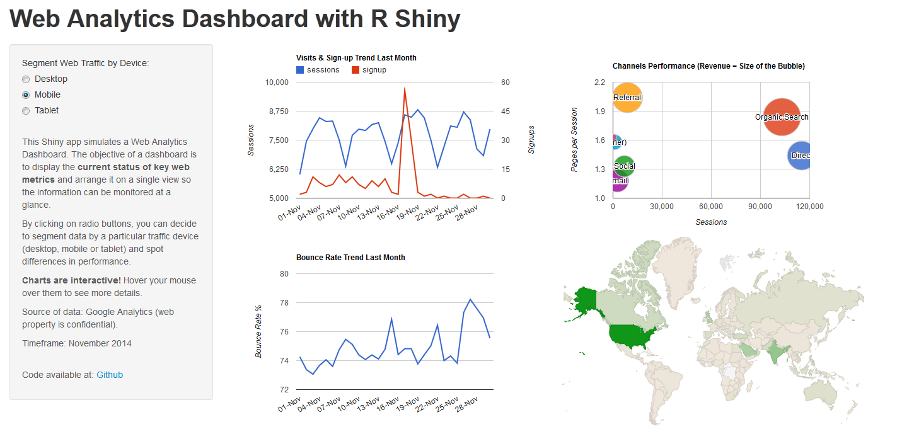
  </div>
  
Source: https://mcpasin.shinyapps.io/WebAnalytics-Dashboard

---

# Examples of Dashboards and Similar Apps Built in R

<div align="center">
  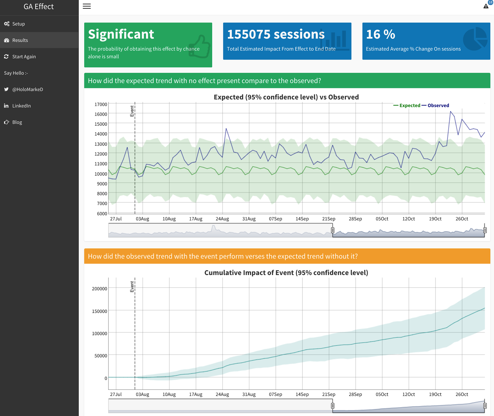
  </div>
  
Source: http://markedmondson.me/how-i-made-ga-effect-creating-an-online-statistics-dashboard-using-reais

---

# Examples of Dashboards and Similar Apps Built in R

<div align="center">
  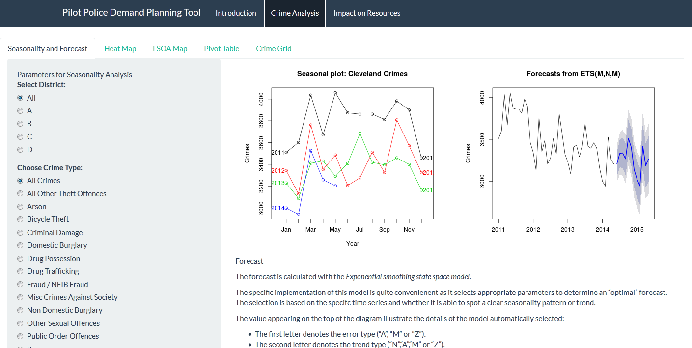
  </div>
  
Source: https://smartinsightsfromdata.shinyapps.io/TSupplyDemand/


---

# Basic Template of a Shiny App with rCharts 

```
# ui.R
library(rCharts)
shinyUI(fluidPage(
  h2("rCharts Example"),
  sliderInput("slider", "Number of observations:", 1, 1200, 500),
  showOutput("myChart", "highcharts")))
```

```
# server.R
library(rCharts)
library(plyr)
merged <- read.csv("data/merged.csv")
shinyServer(function(input, output) {
  output$myChart <- renderChart({
    PIs_by_product <- ddply(head(merged, input$slider), c("Application"), summarise,
                           uniquePIs = length(unique(PI_name)))
    mostPopularProduct <- hPlot(uniquePIs ~ Application, type = "column", 
                                data = PIs_by_product, title = "Most Popular Product")
    mostPopularProduct$addParams(dom = "myChart")
    return(mostPopularProduct)    
  })})
```

---

## shinydasboard package

* developed by Winston Chang (winston@rstudio.com)
* find source files here: http://rstudio.github.io/shinydashboard/index.html
* usage: 2 files - ui.R and server.R

```
# ui.R
library(shinydashboard)
library(shiny)
dashboardPage(
  dashboardHeader(# title of dashboard),
  dashboardSidebar(# code for sidebar tabs  ),
  dashboardBody(# tabs corresponding to sidebar code, boxes with charts  )
)
# server.R
# put here code, executed only when first time run
shinyServer(
  function(input, output) {
    # code for charts, code will be run once per visit; inside render..() or reactive() func - reactive runs
  })
```

---

## Demo Dashboard


---

## Resources Used (on KPIs, rCharts and Shiny)


* Stacey Bar, Performance Measurement Process: http://staceybarr.com/
* Stephen Few. Information Dashboard Design: Displaying Data for At-a-Glance Monitoring: http://www.amazon.com/Information-Dashboard-Design-At-Glance/dp/1938377001/ref=pd_sim_b_3?ie=UTF8&refRID=1CZ30V5X6TCQGHEQ719J
* Dona Wong, Guide to Information Graphics: http://donawong.com/
* Getting Started: http://ramnathv.github.io/rCharts/
* What happens behind the scenes: http://rcharts.io/howitworks/ 
* Presentation on how to share: http://rcharts.io/NYC_May_2014/slides/02_share/#5
* Examples by creator: http://ramnathv.github.io/rChartsShiny/
* Example of shiny app with downloading data from internet: https://github.com/ramnathv/rChartsShiny/blob/gh-pages/rChartOECD/global.R
* Great examples of all types of charts in NVD3: http://ramnathv.github.io/posts/rcharts-nvd3/index.html
* Great examples with Highcharts: http://rpubs.com/kohske/12409 (and this one http://rstudio-pubs-static.s3.amazonaws.com/16699_4bc388ebe1454c84aaab3d22d17e3aaf.html)
* What chart to use when: http://timelyportfolio.github.io/rCharts_nvd3_systematic/cluster_weights.html
* Examples from Ramnath NVD3: https://github.com/ramnathv/rCharts/blob/master/inst/libraries/nvd3/examples.R

---

## Resources Used (on rCharts and Shiny)

* How to embed into Rmarkdown: http://bl.ocks.org/ramnathv/raw/8084330/ (and this http://timelyportfolio.github.io/rCharts_share/showingoff.html)
* A very detailed explanation on how to use Highcharts API for rCharts:http://reinholdsson.github.io/rcharts-highcharts-api-docs/


---

## THANK YOU! Questions?


---

## Extra Slides 

---

## Things to Remember(rCharts)

* In a shiny app use function: showOutput("myChart", "polychart"), where you specify the name of the output object and the name of the library in lowercase. 
* Don't forget plot$addParams() and return() in the output element used to create rCharts in server.R file
* If you can't see your chart in Viewer of Rstudio, try opening it in browser by clicking the Open in Browser button.
* Sometimes, if a chart doesn't show up in a Shiny app with several rCharts, you may have to use this "wrapping" trick (not necessary if you use shinydashboard):

```
div(class='wrapper', tags$style(".highcharts{ height: 100%; width: 800px;}"),
showOutput("infChart", "highcharts"))
```

---

## rCharts API

A lot of the "properties" of the plot object can be customized. All you need to do is get access to the documentation of the rChart library or the original JavaScript library.

To demonstrate the depth of possible customization, we will use an example Highcharts JavaScript library, using their Reference page: http://api.highcharts.com/

---

## Highcharts API Example

Below are the casual "rules" of conversion for HighCharts.

* the elements of a chart are in an object in JS, that gets converted into a list in R; the main object properties will look like this, e.g. `mychart$chart()` or `mychart$plotOptions()`
* these main properties have nested properties, and if the property you customize doesn't have more nested properties (chart: {height: 800}), then use "=" to simply assign that value to a parameter in R, e.g. `mychart$chart(height = 800)`
* if the properties you're attempting to customize have any "nested" properties - use "=" to assign a list() inside of which you will put what is "nested", e.g.

  `mychart$plotOptions(column = (dataLabels = list(enabled=TRUE)))`

---

## Highcharts API (Cont.)

The following demonstration will make these "rules" much clearer.

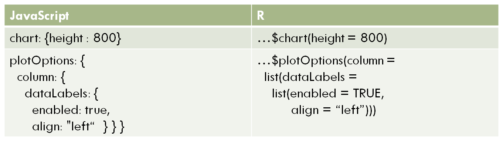

---

## Example of Customization
The following example just scratches the surface of all the things you can do in rCharts.

```{r echo = F, results = 'asis', warning = FALSE}
library(rCharts)
fruits<-data.frame(name = c("John", "Alice", "Andy", "Sam", "John", "Alice", "Andy", "Sam"), quant = c(23, 15, 20, 10, 5, 4, 10, 8), fruit = c(rep("Apples", 4), rep("Oranges", 4)))


samplePlot<- hPlot(quant ~ name, data = fruits, group = "fruit", type = 'column', 
                   title = "Quantity of Fruits Collected by Children")
samplePlot$xAxis(title = list(text="Name of Child"), type = "category", labels = list
                 (rotation = 60, align = "left"))
samplePlot$chart(height = 500, zoomType = "xy")
samplePlot$colors("#339900", "#FF9900")
samplePlot$plotOptions(column = list(stacking = "normal", dataLabels = list(enabled = T, 
                              align = 'center', verticalAlign = "top", 
                              color = '#FFFFFF', y = 10)))
samplePlot$yAxis(title = list(text = "Quantity of Fruits"), tickInterval = 2)
samplePlot$legend(align = 'center', verticalAlign = 'top', y = 30, margin = 20)
samplePlot$show('inline', include_assets = TRUE, cdn = TRUE)
```


---


## Code for the Demo

```
fruits<-data.frame(name = c("John", "Alice", "Andy", "Sam", "John", "Alice", "Andy", "Sam"), 
quant = c(23, 15, 20, 10, 5, 4, 10, 8), 
fruit = c(rep("Apples", 4), rep("Oranges", 4)))

samplePlot<- hPlot(quant ~ name, data = fruits, group = "fruit", type = 'column', 
                   title = "Quantity of Fruits Collected by Children")
samplePlot$xAxis(title = list(text="Name of Child"), type = "category", labels = list
                 (rotation = 60, align = "left"))
samplePlot$chart(height = 500, zoomType = "xy")
samplePlot$colors("#339900", "#FF9900")
samplePlot$plotOptions(column = list(stacking = "normal", dataLabels = list(enabled = T, 
                              align = 'center', verticalAlign = "top", 
                              color = '#FFFFFF', y = 10)))
samplePlot$yAxis(title = list(text = "Quantity of Fruits"), tickInterval = 2)
samplePlot$legend(align = 'center', verticalAlign = 'top', y = 30, margin = 20)
samplePlot
```

